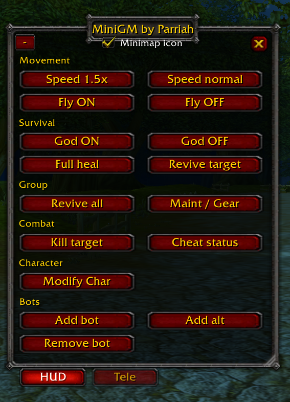
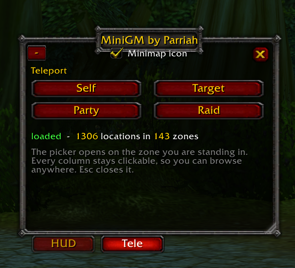
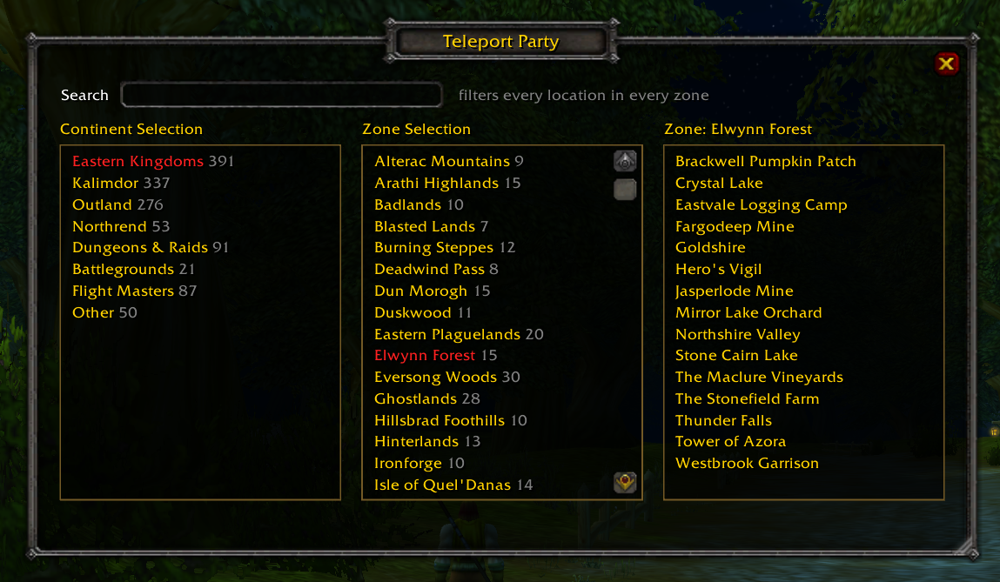
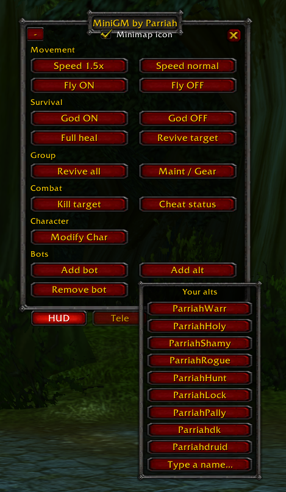
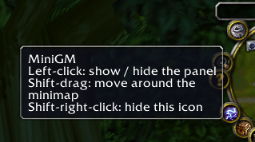

<h1 align="center">MiniGM</h1>
<p align="center"><em>A GM's player companion for AzerothCore 3.3.5a</em></p>
<p align="center">Built by a private server owner who actually plays the game as a GM.</p>
<p align="center">by <strong>Parriah</strong></p>

<p align="center">
  
  
  
  
  
  
</p>

---

## First, some context

*Skip to [Why this exists](#why-this-exists) if you already run a realm.*

**World of Warcraft** launched in 2004 and became the biggest subscription game ever made. Guinness still lists it that way — [12 million subscribers at its peak](https://www.guinnessworldrecords.com/world-records/116965-most-popular-subscription-based-videogame-ever) in October 2010. For a lot of people it was *the* online game of a decade, and for plenty of us it's where our friends were.

**Wrath of the Lich King**, the 2008 expansion, is the one many players point to as the high-water mark. Patch **3.3.5a** is its final build, and it's the version everything below is about.

Games move on, though. Expansions replace each other, systems get redesigned, and the version you spent years in simply stops existing. That's most of why server emulation happened. People wanted a specific version of the game to stay playable, so they worked out how to run the server side themselves, and that effort has been going almost as long as the game has. It's where private servers came from.

### AzerothCore

[**AzerothCore**](https://www.azerothcore.org/) is where a lot of that work ended up. It's an open-source game server you run yourself — a complete, free implementation of the server side, targeting 3.3.5a. You install it on a spare PC or a small home box, point a 3.3.5a client at it, and you have your own realm.

It's GPLv2 and community-maintained, and it carries that whole lineage with it: MaNGOS, then TrinityCore, then SunwellCore, which AzerothCore forked from in 2016. The project describes itself as a learning resource as much as a game server, and that's fair — there's a lot of well-documented C++ in there for anyone curious how an MMO actually works underneath.

**Why it's worth caring about**

- **It's your realm.** Your rates, your rules, your patch. Nothing expires, nothing gets sunset, nobody redesigns the game out from under you.
- **It's free and yours to modify.** Open source, actively maintained, with a large [module catalogue](https://www.azerothcore.org/catalogue.html) the community keeps growing.
- **It runs on modest hardware.** A used office desktop is genuinely enough. Mine is a second-hand OptiPlex.
- **Modules make small realms viable.** This is the part people don't expect. [mod-playerbots](https://github.com/liyunfan1223/mod-playerbots) fills your party and raid with AI-controlled characters, so four people — or one — can run five-mans and raids built for twenty-five. On a server with a handful of players, that's the difference between a world you can play in and an empty one.

**MiniGM needs one of these.** It's a client-side addon that sends GM commands to a server. Without an AzerothCore realm where you hold GM rights, it has nothing to talk to. Setting up from scratch, AzerothCore's own [installation guide](https://www.azerothcore.org/wiki/installation) is where to start.

> **On the game client: you're on your own.** Connecting to any realm needs a 3.3.5a client. **I don't link to one, host one, mirror one, or point anyone at where to find one, and please don't ask me to.** AzerothCore is open-source server software and that's what's being discussed here. The client is a separate matter and it's yours to sort out.
>
> Nothing in this repository is a game client or any part of one. It's an interface addon — plain Lua text files that run inside a client you already have, the same as any other WoW addon.

---

## Why this exists

I run a small AzerothCore realm for myself and my family, and I play on it. Most of the time I'm a player. Occasionally I need to be a GM: fly somewhere, heal up, unstick an alt, drag a party of bots across the map.

There are good admin suites for AzerothCore. [AzerothAdmin](https://github.com/superstyro/AzerothAdmin) is the one I used, and MiniGM's teleport data comes from it. But those tools are built for the person *running* the server: spawning NPCs, editing gameobjects, working tickets, browsing the item database. When all you want is to fly to Goldshire and heal yourself, a full eight-tab admin window gets in the way more than it helps.

So I built a small HUD that plays alongside you and doesn't make you stop what you're doing. It's intuitive, moveable and scalable, it stays out of the way, and it remembers where you left it.

> **I'm a cybersecurity professional, not a developer.** I built this with [Claude](https://claude.ai). The design calls, the bug reports and every hour of in-game testing are mine, but I didn't hand-write the Lua. There's [more on what that meant](#how-this-was-built) at the bottom, including the two bugs that shipped and only got caught by playing the game.

<p align="center">
  
</p>

---

## What's in it

### HUD tab

| Section | Buttons | Notes |
|---|---|---|
| **Movement** | Speed *n*× · Speed normal | Defaults to 1.5×. There's no button to change that — it's a [typed command](#commands), and the button relabels itself when you do. Hits your target if you have one, otherwise you. |
| | Fly ON · Fly OFF | GM flight that's actually fast. [This took a while to work out.](#flight-speed-is-a-lie) |
| **Survival** | God ON · God OFF | `.cheat god`, always on you |
| | Full heal | An actual heal, not the max-HP hack you'll find in old macro guides |
| | Revive target | The selected player or bot |
| **Group** | Revive all | Revives you and tells the bots to revive. Different commands for each. |
| | Maint / Gear | `maintenance` + `autogear` + `nc -loot`, spaced properly |
| **Combat** | Kill target | `.die`, with guards so it won't hit you or a friendly |
| | Cheat status | What the *server* thinks is on. Handy after a relog. |
| **Character** | Modify Char | Set level and add gold on your target. Level only goes up. |
| **Bots** | Add bot | Pick a class, get a bot at your level |
| | Add alt | Your own characters, remembered for you |
| | Remove bot | Logs a bot or alt out. Pre-filled with your target. |

### Tele tab

1,306 locations. Pick who's going first — Self, Target, Party or Raid — then the picker opens on whatever zone you're standing in.

Three columns: continent, zone, location. All of them stay clickable, so the starting zone is a convenience and not a cage. There's a search box that filters every location in the game by name, which is usually faster than drilling when you know where you want to go.

143 zones, 83 maps, split into Eastern Kingdoms (391), Kalimdor (337), Outland (276), Northrend (53), Dungeons & Raids (91), Battlegrounds (21), Flight Masters (87) and Other (50).

<p align="center">
  
</p>
<p align="center"><sub>First, who's going.</sub></p>

<p align="center">
  
</p>
<p align="center"><sub>Then the picker opens on the zone you're standing in. Elwynn Forest is selected here because that's where I was.</sub></p>

### Two things people notice first

**Drag the corners.** Both windows have a grip on the bottom-right. Drag it and everything scales together, and the panel and picker size independently. If you play at 1440p you'll want this about four seconds after installing.

It scales instead of resizing because every button sits at a hardcoded pixel offset. Stretching the frame would leave them all huddled in the top-left corner looking broken.

**It learns your alts.** You never type a character name. MiniGM notes every character you log into, and Add alt lists them back to you. Click to log one in as a bot, right-click to forget it. If you run ten alts as a standing bot party, this saves you remembering how you spelled *Parriahshamy* at 1am.

<p align="center">
  
</p>
<p align="center"><sub>Every character you've logged into, listed back to you.</sub></p>

### Everything else

<p align="center">
  
</p>

There's an optional minimap icon (left-click opens, shift-drag moves it, shift-right-click hides it). You can collapse the panel to its title bar, and the tabs still work collapsed. Esc closes the picker. Positions, sizes, minimap angle, alt list and speed settings all survive a relog.

Destructive buttons refuse before they fire rather than asking afterwards. Kill won't target you or a friendly. Level won't go down. Modifying your own character makes you type `Accept` first, which has saved me at least twice.

---

## Commands

**These are typed into chat. There are no buttons for them** — everything the panel does with a click is in the tables above; this is the rest.

`/mgm` on its own shows and hides the panel. `/minigm` works too if you'd rather type it out.

| Command | Range | Default | Does |
|---|---|---|---|
| `/mgm` | | | show / hide the panel |
| `/mgm help` | | | prints all of this in game, with your current values |
| `/mgm minimap` | | off | turn the minimap icon on or off |
| `/mgm scale <n>` | 0.5–2.0 | 1.0 | panel size, same as dragging its corner |
| `/mgm telescale <n>` | 0.5–2.0 | 1.0 | picker size, same as dragging its corner |
| `/mgm reset` | | | both windows back to centre at normal size |
| `/mgm alts` | | | list the alts it's remembered |
| `/mgm addalt <A,B>` | | | add names by hand, comma separated |
| `/mgm forgetalt <Name>` | | | drop one (or right-click it in the Add alt list) |
| `/mgm runspeed <n>` | 0.1–50 | 1.5 | ground speed multiplier the Speed button sends |
| `/mgm flyspeed <n>` | 0.1–50 | 4.65 | flight speed multiplier |
| `/mgm flymount <id>` | | 28652 | mount displayID used for fast flight |
| `/mgm titlefit <n>` | 1.0–4.0 | 1.9 | width of the title bar art, if your title overflows it |

`runspeed`, `flyspeed` and `flymount` stick around between sessions, so you set them once. The speed limits aren't mine — 50 is what the server accepts.

---

## How it works

Every button types a chat command. Clicking God ON puts `.cheat god on` into `/say` and the server does the rest, checking your gmlevel exactly as if you'd typed it. There's no server module and nothing to install on the realm.

That explains most of the questions people have:

- **A button does nothing?** Your gmlevel is below that command. Type `.commands` to see what you're allowed.
- **Everything goes out in `/say`.** Anyone standing near you can read it. That's just how addons issue commands in 3.3.5a.
- **MiniGM can't see what happened.** It sends and moves on. That's why Cheat status exists: it asks the server rather than guessing.

Messages queue at one per 0.4 seconds, and each one is echoed to your chat frame in gold so you can see what went out.

---

## Requirements

| | |
|---|---|
| **Client** | 3.3.5a, build 12340. Interface 30300. |
| **Server** | AzerothCore. Other WotLK cores have different command syntax and are untested. |
| **gmlevel** | 2 for nearly everything. 3 for `.character level`. |
| **Addon libraries** | None. No Ace3, no LibStub, no LibDBIcon. Two Lua files and a `.toc`. |
| **Server module** | [mod-playerbots](https://github.com/liyunfan1223/mod-playerbots) is **required for the Bots section and for Party/Raid teleport**. Without it those buttons send commands your server won't understand. Movement, survival, combat, character and Self/Target teleport all work fine without it. |

### Server hardware

The addon costs nothing. These are for the realm it assumes you're running, taken from a live 3.3.5a server with mod-playerbots and an AH bot:

| | Minimum | Comfortable |
|---|---|---|
| CPU | 2 cores | 4 cores, i5/i7 7th gen or later. Worldserver is mostly single-threaded, so clock speed matters more than core count. |
| RAM | 8 GB | 16 GB. Memory runs out long before CPU does — worldserver hit about 6 GB during a mass bot login, on top of MySQL's 4 GB pool. |
| Disk | 40 GB SSD | 256 GB SSD. Databases plus dated backups add up faster than you'd think. |
| OS | any modern Linux | Ubuntu Server LTS, which is what AzerothCore's own docs target. |

Bot count is what eats memory. 50–200 random bots is fine on 16 GB. Raise `MaxRandomBots` in steps of about 50 and watch `free -h` under load, plus the log for "World update time exceeded".

You don't need to port-forward a private realm. Tailscale or WireGuard with a subnet router advertising the realm's `/32` gets you remote play with nothing exposed and no client changes.

---

## Install

1. Download the ZIP — green **Code** button above, or from **Releases**.
2. Extract it somewhere.
3. Copy `MiniGM.toc`, `MiniGM.lua` and the whole `Tele` folder into a folder called `MiniGM` inside `Interface\AddOns`.
4. Restart the client. `/reload` won't find a new addon.
5. Type `/mgm`.

You want to end up with exactly this:

```
<World of Warcraft>\Interface\AddOns\MiniGM\
    MiniGM.toc
    MiniGM.lua
    Tele\TeleportDB.lua
```

**The folder has to be called `MiniGM`.** GitHub's ZIP extracts to `MiniGM-main`, and if you drag that straight into `AddOns` the client won't load it. Rename it, or copy the files out of it. The `.toc` filename has to match the folder name, which is a WoW rule and not something I can work around.

**Don't skip the `Tele` folder.** That's where the 1,306 locations live. Without it the addon loads but the Tele tab reports the database is missing.

The docs, LICENSE and CHANGELOG don't need copying. WoW ignores them.

You should see `MiniGM: v1.0.0-rc loaded`, and the Tele tab should report `loaded - 1306 locations in 143 zones`. If it says the database didn't load, the `Tele` folder didn't copy.

More detail and troubleshooting in [docs/INSTALL.md](docs/INSTALL.md).

---

## Docs

The documentation is written so you can hand it to an LLM. You don't need to read Lua to use this addon, or to change it.

Upload [docs/MASTER-GUIDE.md](docs/MASTER-GUIDE.md) to Claude or ChatGPT and ask it whatever you want — how to get your bots to follow you into Karazhan, why your flight speed is being ignored, what a given button actually sends, how to add your own teleport locations. It's one self-contained file with enough context to answer properly instead of guessing.

That's on purpose. This addon exists because a GM who doesn't write Lua wanted specific things and worked through them one at a time. The docs are set up so the next person can do the same.

| Document | Covers |
|---|---|
| [MASTER-GUIDE.md](docs/MASTER-GUIDE.md) | everything, one file, built for LLM upload |
| [INSTALL.md](docs/INSTALL.md) | installing, verifying, updating, uninstalling, troubleshooting |
| [USER-GUIDE.md](docs/USER-GUIDE.md) | every button and slash command, what it sends, what stops it |
| [COMMANDS.md](docs/COMMANDS.md) | every command it can emit, with gmlevel and risk, plus what it never sends |
| [ARCHITECTURE.md](docs/ARCHITECTURE.md) | how it's built, and eleven 3.3.5a API traps |
| [TELEPORT-DATA.md](docs/TELEPORT-DATA.md) | the teleport database: schema, provenance, repairs, how to regenerate |
| [ATTRIBUTION.md](docs/ATTRIBUTION.md) | what's borrowed and what the licence asks of you |
| [CHANGELOG.md](CHANGELOG.md) | version history, including the private builds |
| [CONTRIBUTING.md](CONTRIBUTING.md) | ground rules if you want to work on it |

---

## Things that cost me time

Each of these ate hours. They're written down so they don't eat yours.

### Flight speed is a lie

`.gm fly on` only calls `SetCanFly()`. Every flight speed rate gets accepted by the server and then ignored once you're airborne. What makes it maddening is that the same `.modify speed all 6` does nothing in the air but makes you dramatically faster on the ground, so it looks like the command worked.

Flight speed only applies while a mount aura is up. So Fly ON sends `.gm fly on` and then `.modify mount <displayID> <speed>`. The mount is temporary, an aura and a model rather than a learned mount, so your riding progression is untouched.

A watchdog checks `IsMounted()` every 3 seconds, because the aura can get dropped and you won't always notice. It isn't consistent — I've flown around inside the Stormwind auction house with it holding fine — but when it does go, you lose your speed silently and wonder why you've slowed down. The watchdog waits out combat, retries three times, then gives up and falls back to plain GM fly so you don't drop out of the sky.

> **Don't use displayID `28082`.** The flying carpet crashed my worldserver the moment it was applied. systemd brought it back 15 seconds later and about 15 minutes of unsaved play was gone. The same speed value with `28652` is fine, so it was the model, not the number. MiniGM defaults to `28652`.

### `.modify hp` doesn't heal

It calls `SetMaxHealth(n)`. It sets your maximum.

The `.modify hp 999999` you'll find in old guides isn't a heal, it's a max-HP hack. MiniGM's Full heal sends your real `UnitHealthMax`, which restores you and changes nothing, and rebuilds itself as you level.

### Bots ignore `.summon`, and humans ignore what works

I found this by building the wrong thing first. The obvious approach to moving your party is `.go xyz` and then `.summon` on each member. The server accepts `.summon <bot>`, prints "You are summoning [Bot]", and the bot doesn't move an inch. It's aimed at players.

Playerbots respond to mod-playerbots' own `summon` in party or raid chat, which also moves the whole group in one message instead of one command each. A 25-man raid went from ten seconds of queued chat down to a single line.

It cuts both ways. A human in your party ignores the chat `summon`. Target sends both forms because it can't tell what you've selected, and Party/Raid can't move a human at all. Use Target for people.

### `.go xyz` only moves you

There's no target or group version. The commands that move someone else, `.tele name` and `.tele group`, take a named location out of the server's `game_tele` table rather than coordinates, so you can't drive them from a coordinate list. That's why MiniGM teleports you and then summons instead of moving the group directly.

### The client eats chat bursts

Three `SendChatMessage` calls in one frame delivered two. The Maint/Gear button needed clicking twice for a while before I worked out why. Everything queues at one message per 0.4 seconds now, which also means ordering is guaranteed and `.go xyz` always lands before the `summon` behind it.

### Secure macros die in combat

Speed, Full heal and Revive all use `/target [noexists] player` so they hit you when nothing's selected and your target when something is. Blizzard blocks `/target` from a macro during combat, so those four buttons do nothing while you're fighting. MiniGM says so rather than failing quietly.

### `autogear reset` will ruin your day

Plain `autogear` only swaps a slot when the new item scores 1.2× the old one, and the replaced item goes to bags. `autogear reset` calls `DestroyEquippedGear` and destroys everything the bot is wearing. MiniGM never sends it. Clear some bag space on the bot first or it'll skip slots.

---

## Credits

### AzerothAdmin

[AzerothAdmin](https://github.com/superstyro/AzerothAdmin), by the SuperStyro Dev team and the Manground Dev Team, GPLv3.

The 1,306 teleport locations come from its `Data/TeleportTable.lua`. Someone stood in 1,307 places across Azeroth, Outland and Northrend and wrote down where they were. As far as I know there's nothing else like it for WotLK.

I regrouped it from twelve categories into eight, fixed nine broken coordinate strings, and dropped one duplicate. All of that is recorded in [TELEPORT-DATA.md](docs/TELEPORT-DATA.md) and in the data file's own header. The data is theirs. Any mistakes I made handling it are mine.

If you want a full admin suite, use AzerothAdmin. MiniGM isn't trying to replace it.

### TrinityAdmin and MangAdmin

```
MangAdmin  ->  TrinityAdmin  ->  AzerothAdmin  ->  MiniGM
```

AzerothAdmin is itself a derivative, with GPLv3 notices in its source going back to the Free Software Foundation in 2007. Almost two decades of people passing this along. That chain is why MiniGM is GPLv3 and why it stays that way.

### AzerothCore

[AzerothCore](https://www.azerothcore.org/), the server this is for. Its [GM command reference](https://www.azerothcore.org/wiki/gm-commands) documents everything MiniGM sends, and the [`game_tele` page](https://www.azerothcore.org/wiki/game_tele) is where I finally worked out that `.go xyz` can't move anyone but you.

### mod-playerbots

[mod-playerbots](https://github.com/liyunfan1223/mod-playerbots) by liyunfan1223 and contributors. Every bot command here, the `summon` that makes group teleport work, `maintenance` and `autogear`. The whole design assumes you're playing alongside bots, which only works because of this module.

### How this was built

I'm a cybersecurity professional. I'm not a developer, and I want to be straight about that, because developers get overlooked constantly and I could never do what they do.

What I do have is years of working alongside good ones. I've learned the SDLC from them: beta, staging, test, QA, push to prod, then keep QA'ing after it's live. Enough to read a codebase and follow how it hangs together, env vars and structure and the rest. Enough to write a script. Not enough to have written this from nothing.

That discipline is most of what made this work. Every version in the changelog was a real build — written, installed, tested in game, kept or thrown away. There are fifteen source snapshots behind this release and a release candidate in front of it for exactly that reason.

**Every line of Lua and every word of documentation here was written with AI assistance**, using [Claude](https://claude.ai). I decided what it should do, I found the bugs, and I did all the testing in game. This is my first attempt at building something the community hadn't already provided, and with Claude I got to build it myself.

Since people ask what that's actually like: the `.summon` bug is the one I keep coming back to. The model confidently built a per-member summon loop, the server accepted every single command, and not one bot moved. What caught it was noticing that `/p summon` worked when the addon's version didn't. Playing the game found the bug, not reading the code.

Same story with the teleport picker being two pixels too narrow for its own columns. The location data had been verified six different ways and nobody thought to check the arithmetic on the frame until a screenshot made it obvious.

If you find something that looks confidently wrong here, that's a real possibility. Please report it.

---

## Licence

GPLv3. See [LICENSE](LICENSE).

This isn't a preference, it's an obligation. Using AzerothAdmin's GPLv3 data makes MiniGM a derivative work, so it carries the same licence with source available. Credit on its own doesn't cover it, though the credit above is given freely regardless.

Use it, change it, pass it on, same terms. Nothing here costs money and you don't need anyone's permission.

More detail in [docs/ATTRIBUTION.md](docs/ATTRIBUTION.md).

---

<p align="center"><sub>
Not affiliated with or endorsed by Blizzard Entertainment, AzerothCore, mod-playerbots or AzerothAdmin.<br>
World of Warcraft is a trademark of Blizzard Entertainment, Inc.
</sub></p>
